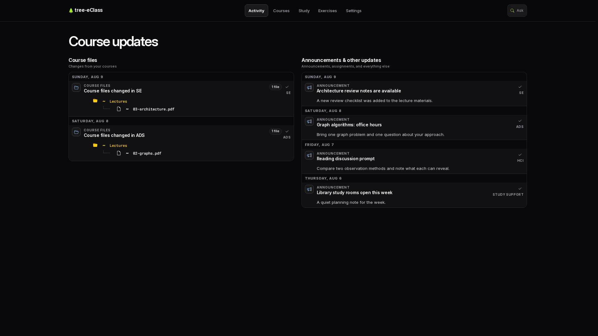
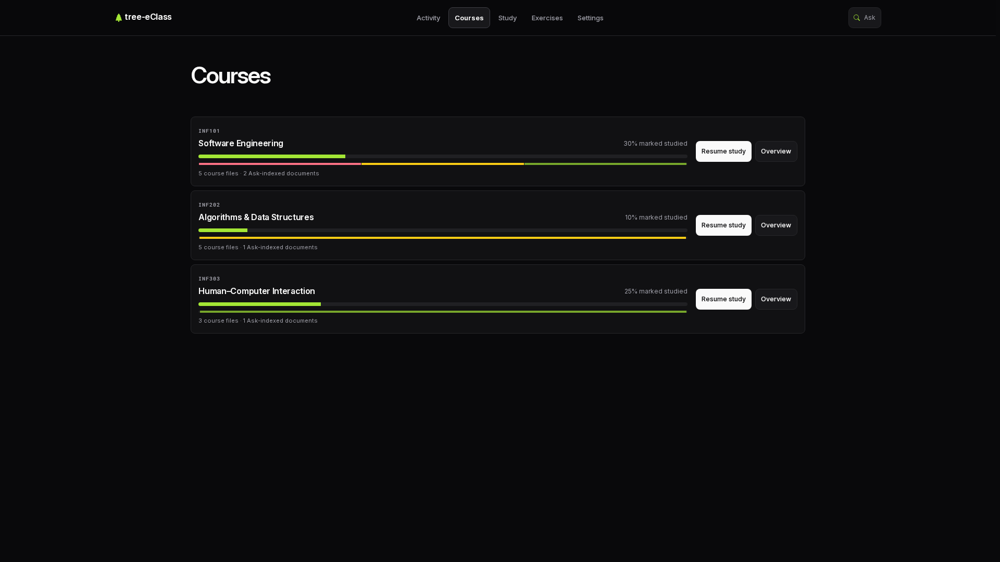
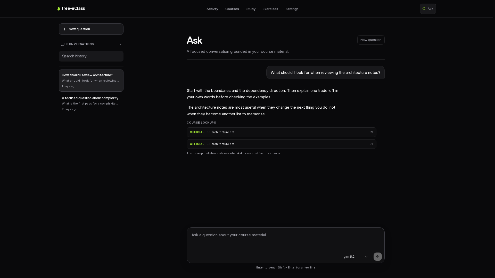

# tree-eClass

A personal, evidence-backed university learning cockpit.

> See what changed, choose one meaningful next action, read the source, and ask focused questions without losing provenance.

<p align="center">
  
  
  
</p>

The interface is intentionally serious and information-first. It is built for one learner working across university course trees, official course material, prior exams, personal notes, and community discussion. Activity, generated guidance, and system metadata stay distinguishable from learning itself.

## What it does

- **Activity** — triage course announcements, file changes, assignments, and history.
- **Courses** — browse synchronized course trees, study levels, indexed material, and recent context.
- **Study** — select one next action using course evidence, exam plans, and adaptive guidance.
- **Session** — read deeply in the document workspace with highlights, notes, recall, and reading history.
- **Ask** — have a focused conversation grounded in course material, with consulted sources shown beside the answer.
- **Settings** — configure courses, synchronization, preferences, knowledge indexing, AI backend priority, and task-specific model defaults.

Evidence keeps its origin: official material, past exams, community-authored content, and learner-created notes do not silently become interchangeable.

## Architecture

```text
./tree                  Installed Go lifecycle controller; manual start/stop
├── PostgreSQL 18       One authoritative relational database
├── SeaweedFS           Local versioned S3 document/object storage
├── tree-eclass         Go JSON API, read-only MCP, queues and background jobs
│   └── native helpers  Short-lived Python parsers, OCR, PDF and Discord export
└── Browser assets      React UI, routing and direct API requests; served by Go
```

Services bind to loopback. Expensive work is serialized, database connections and
helper resources are bounded, and Python has no persistent API or worker process.
Stable releases contain the compiled Go application, frontend, Python interpreter,
locked parser packages and relocated native document helpers.

## Local development and regular use

The local machine owns the database and S3 store. Startup uses no login services,
container engine, or external Git hosting. The private `laptop` Git remote is a
local bare repository; only sanitized, public-safe history is published.

### Daily Mac start and stop

```sh
./tree up                 # fixed, selected stable release
./tree down               # stop all owned services and remove disposable output
./tree dev up             # editable code; take a cold stable checkpoint first
./tree dev down           # discard development data and restore that checkpoint
./tree status
```

Open <http://127.0.0.1:8000>. Only one application mode runs at a time, using one
active dataset. **Development writes are always discarded on exit**, including
schema, documents and mutable settings. Go edits restart the API in development;
completed frontend builds reload the browser. Stable use starts no JavaScript server.
Switch back with `./tree up` to compare the fixed release on restored stable data.
Stale browser tabs cannot submit writes after switching modes; reload the page.

When `Local mirror path` is configured in Settings, each successful course check
refreshes the derived projection under that path in the user's home directory.
Upstream files live under `<course>/eclass`; current external-library objects live
under `<course>/external`, and stable browser uploads refresh that subtree
immediately. Leave it blank to disable mirroring. It is never authoritative: S3
object versions remain authoritative, external redirects stay in the course
manifest, and a failed mirror never deletes the published catalog.

On a new setup there is no selected release. Development can start immediately;
stable use first requires the reviewed implementation to be committed and built.
The controller does not create commits automatically.

### Setup and releases

On Apple Silicon macOS, install Go, Bun, uv, PostgreSQL 18, Tesseract, Poppler,
sevenzip and diff-pdf, then run `./tree setup`. Setup installs a durable Go controller,
verifies pinned SeaweedFS, Python, parser packages, Greek/English OCR models and
Discord export tools, installs frontend dependencies, and initializes fresh private
storage only when no registered dataset exists. It preserves legacy caches and keys.
If nix-darwin manages Homebrew, declare the Homebrew prerequisites in its
configuration before rebuilding; do not install them manually.

```sh
./tree controller update  # after controller changes, while fully stopped
./tree release promote    # build, activate and start the current clean commit
./tree release build      # requires a clean committed checkout
./tree release use SHA    # activate that full commit ID against restored stable data
./tree release rollback   # restore the previous activation checkpoint; stays stopped
./tree snapshot list
```

`release promote` performs the complete build-and-activation flow in one command.
It preflights the clean checkout, builds the current commit while the existing
mode remains available, then stops the runtime, activates the release and starts
stable mode. A failed build leaves the existing runtime running; an activation
failure leaves the runtime stopped for inspection.

Activation promotes code only and migrates a checkpointed stable dataset. Restoring
an older checkpoint discards later stable writes and reports its rescue checkpoint.
Shutdown uses the installed controller even if editable Go source no longer builds.
No login services are installed.

### Low-disk development policy

`./tree down` removes owned build caches, temporary parser workspaces and browser build output.
Release builds use a separate disposable cache so they can run during development.
Retention protects selected/previous releases, the latest completed build and every
retained checkpoint's code. APFS checkpoints share blocks until those blocks change.
Local checkpoints protect switching and rollback; they remain on the same laptop.

While fully stopped, `./tree clean` removes disposable output and applies retention.
`./tree storage collect` takes a cold checkpoint, prunes unreferenced catalog objects
and explicit S3 versions, then requests SeaweedFS vacuum. It preserves historical
references and unknown namespaces. Vacuum logs and retained checkpoints determine
physical disk reclamation; logical deleted bytes are not free-disk measurements.

## Verification

```sh
./tree check
```

The native gate suspends the application, builds the React browser app, runs Go race tests using
private synthetic PostgreSQL/S3 clusters, verifies relocated parser/helpers and
static browser delivery, runs frontend tests and quality gates, cleans output, then resumes
the previous mode. It does not synchronize real courses or call external providers.

Focused checks:

```sh
go -C backend test ./cmd/... ./internal/...
go -C backend test -race ./cmd/... ./internal/...
go -C backend vet ./cmd/... ./internal/...
python3 scripts/quality/audit_limits.py
(cd frontend && bun run lint)
frontend/node_modules/.bin/oxfmt --check .
ruff check . && ruff format --check .
```

Do not use `go test ./...`: frontend dependencies contain unrelated Go sources.
Opt-in native tests require verified tool paths; see the runbook. The supported
runtime launches only the small parser boundary as short-lived Python helpers;
the application API, storage, workers and migrations are implemented in Go.

## Repository map

The Go backend lives under `backend/` and uses the standard module layout:
`backend/cmd/` contains executable entrypoints and `backend/internal/` contains
private application packages. Go's `internal` boundary prevents code outside
the backend module's parent tree from importing implementation packages. There
is no `pkg/` directory because the application currently exposes no reusable
public Go library.

```text
backend/go.mod                Go backend module
backend/cmd/tree/             Native manual lifecycle controller
backend/cmd/tree-eclass/      Go application entry point
backend/internal/app/         HTTP server and lifecycle orchestration
backend/internal/domain/      Learning and learner-facing domain packages
backend/internal/services/    Analysis, chat, library, synthesis and sync
backend/internal/integrations/ E-class, Discord, model and parser integrations
backend/internal/infrastructure/ Storage, process, filesystem and runtime adapters
parser/                       Short-lived Python document parser boundary
frontend/src/                 React Router pages, Ask, study workspace and shell
docs/                         StyleX authoring guide and UI screenshots
```

## Trust boundary

This is a single-user loopback application. Host/Origin validation and runtime
session tokens protect browser writes and stale tabs; they are not multi-user
authentication. Keep credentials and runtime data outside Git. Treat crawled
material and community messages as evidence, never as trusted model instructions.
